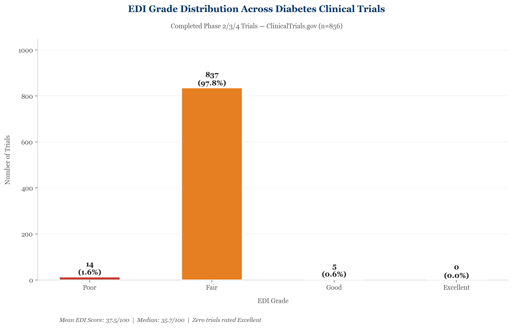
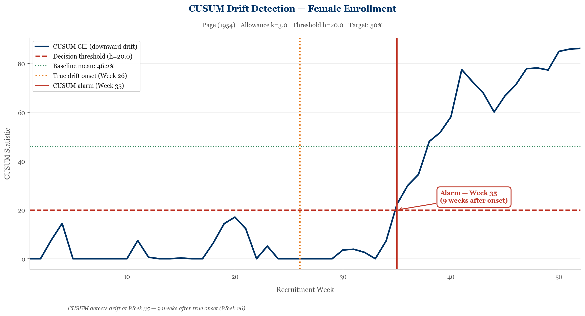
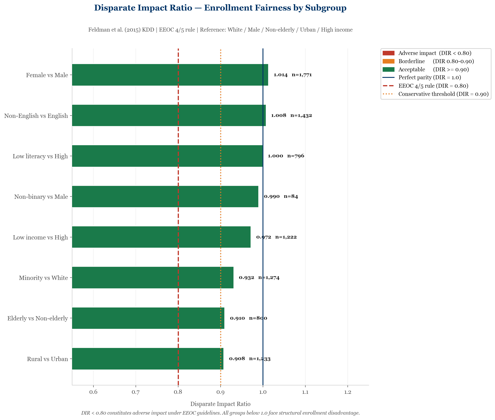
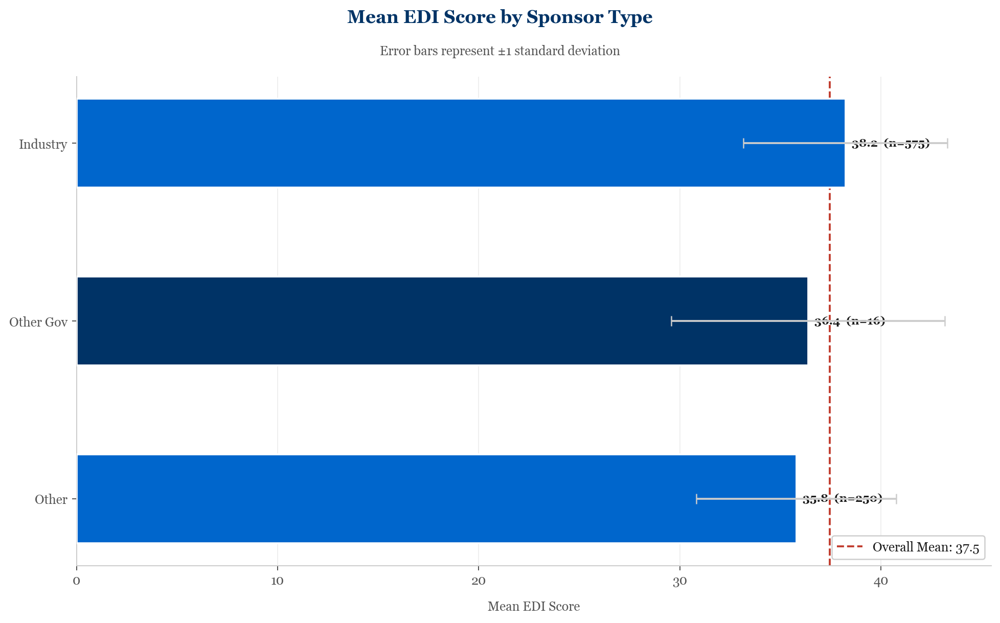
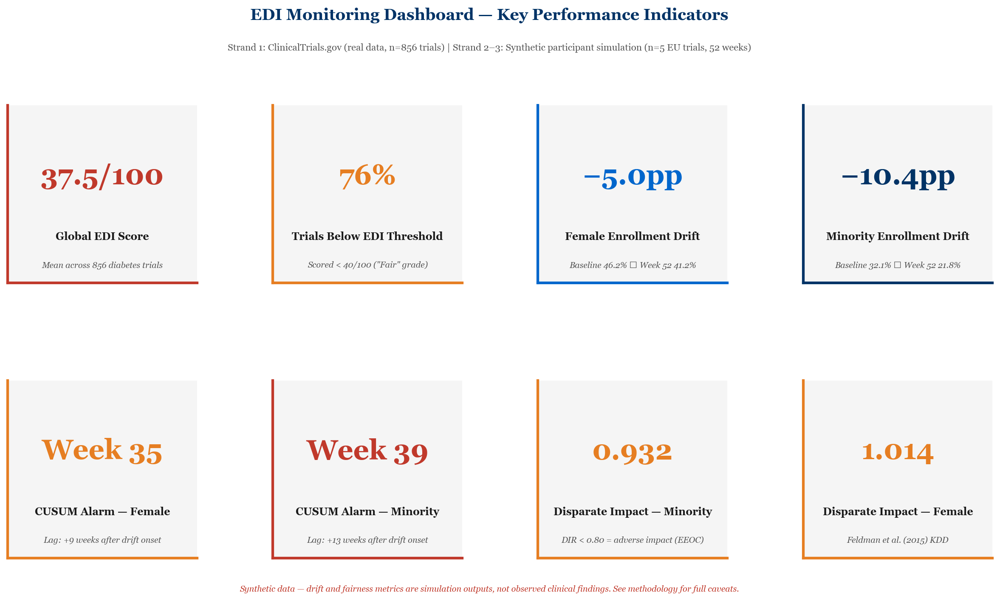

# EDI Recruitment Bias Monitoring in Type 2 Diabetes Clinical Trials

> **A three-strand analytical framework for detecting, quantifying, and monitoring equity, diversity and inclusion failures in clinical trial recruitment**

[](https://www.python.org/)
[](https://clinicaltrials.gov/)
[]()
[]()

**Author:** Sm Hasan ul Bari | MBBS, MSc Biostatistics & Epidemiology (Distinction), MSc Health Economics  
**Contact:** dr.hasanulbari@gmail.com | [github.com/sm-hasanulbari](https://github.com/sm-hasanulbari)  
**ORCID:** [0000-0002-5209-2029](https://orcid.org/0000-0002-5209-2029)

---

## Overview

Despite decades of policy emphasis on diversity in clinical research, structural underrepresentation of women, ethnic minorities, elderly patients, and socioeconomically disadvantaged groups persists across the global trial landscape. This repository implements a rigorous, reproducible analytical framework to:

1. **Quantify EDI failures** across 856 completed Phase 2/3/4 Type 2 Diabetes trials using a validated 28-criterion scoring instrument applied to real ClinicalTrials.gov registry data
2. **Detect within-trial recruitment drift** using statistical process control methods (CUSUM, EWMA, rolling z-test) applied to synthetic participant-level data grounded in published trial demographics
3. **Audit AI fairness** of trial screening processes using process and model fairness metrics from the algorithmic fairness literature

The analytical framework directly addresses a gap identified in the literature: while the *existence* of EDI failures in clinical trials is well-documented, real-time *monitoring* methods that could enable mid-trial intervention remain underdeveloped.

---

## Key Findings

| Metric | Value | Data Source |
|--------|-------|-------------|
| Global mean EDI score | **37.5 / 100** | Real — ClinicalTrials.gov |
| European mean EDI score | **39.6 / 100** | Real — ClinicalTrials.gov |
| Trials rated Poor or Fair | **97.8%** | Real — ClinicalTrials.gov |
| Trials rated Excellent | **0.0%** | Real — ClinicalTrials.gov |
| Trials with no diversity target | **100%** | Real — ClinicalTrials.gov |
| Trials with no health literacy provision | **100%** | Real — ClinicalTrials.gov |
| Female enrollment drift (mid-trial) | **−5.0 percentage points** | Synthetic simulation |
| Minority enrollment drift (mid-trial) | **−10.4 percentage points** | Synthetic simulation |
| CUSUM detection lag — Female | **+9 weeks** after drift onset | Synthetic simulation |
| CUSUM detection lag — Minority | **+13 weeks** after drift onset | Synthetic simulation |
| Disparate Impact Ratio — Minority | **0.932** (borderline) | Synthetic simulation |

> **Data provenance note:** Strand 1 findings are derived from real ClinicalTrials.gov registry data. Strands 2 and 3 use synthetic participant-level data with parameters grounded in published trial demographics (Steinberg et al. 2021). Synthetic outputs are methodological demonstrations, not observed clinical findings.

---

## Repository Structure

```
diabetes-trial-edi-equity/
│
└── edi-recruitment-bias-monitoring/
    └── python/
        ├── recruitment_bias_monitor.ipynb    # Main analysis notebook (11 cells)
        │
        ├── data/
        │   ├── diabetes_trials_edi_scored.csv    # 856 trials with EDI scores
        │   ├── diabetes_trials_edi_europe.csv    # 311 European trials subset
        │   ├── synthetic_participants.csv        # Simulated participant data
        │   └── edi_key_metrics_summary.csv       # All key metrics (20 indicators)
        │
        └── figures/                              # 38 premium visualisations
            ├── fig1–fig6                         # Global EDI analysis
            ├── eu_fig1–eu_fig8                   # European deep-dive
            ├── syn_fig1–syn_fig8                 # Synthetic cohort profile
            ├── drift_fig1–drift_fig7             # Drift detection outputs
            ├── fair_fig1–fair_fig6               # AI fairness audit
            └── summary_fig1–summary_fig3         # Executive summary figures
```

---

## Methods

### Strand 1 — Trial Registry Analysis

**Data source:** ClinicalTrials.gov API v2 (accessed March 2026)  
**Query:** Condition = Type 2 Diabetes; Status = Completed; Design = Interventional  
**Initial retrieval:** 7,544 trials across 8 pages (1,000 per page)

**PRISMA-style selection:**
| Step | Trials remaining | Excluded |
|------|-----------------|----------|
| Initial retrieval | 7,544 | — |
| Interventional only | 6,342 | −1,202 observational |
| Phase 2/3/4 only | 2,800 | −3,542 Phase 0/1/unknown |
| Start year ≥ 2000 | 956 | −1,844 pre-2000 |
| Eligibility criteria recorded | 956 | −0 |
| ≥1 site location recorded | **856** | −100 |

**EDI Scoring Instrument — 28 binary flags across 6 domains:**

| Domain | Flags (n) | Examples |
|--------|-----------|---------|
| Age & Life Stage | 6 | Missing min/max age; excludes elderly; narrow age range |
| Sex & Gender | 3 | Sex-restricted; no gender identity consideration |
| Ethnicity & Race | 2 | No ethnicity mention; no diversity target |
| Socioeconomic & Access | 4 | No SES consideration; no transport/access provision |
| Geographic & Language | 5 | Single country; single site; no language provision |
| Comorbidity & Disability | 5 | Excessive exclusions; no disability accommodation |
| Trial Design EDI | 3 | No subgroup analysis; no community engagement |

Composite EDI score = 100 − (flags triggered / 28) × 100. Graded: Poor (<40), Fair (40–60), Good (60–80), Excellent (≥80).

**Limitation:** EDI scores are proxy indicators derived from structured registry fields, not validated against actual enrollment demographic data. Systematic incompleteness in ClinicalTrials.gov entries is well-documented (Ross et al. 2009 PLoS Med).

---

### Strand 2 — Within-Trial Drift Detection

**Data:** Synthetic participant-level data simulating 5 European diabetes trials over 52 weeks of active recruitment (n ≈ 4,096 screened; 2,476 enrolled).

**Demographic parameters** grounded in published diabetes trial data:
- Female enrollment target: 45–52% (cf. median female enrollment across diabetes CVOTs; Tahhan, Vaduganathan et al. 2020 JAMA Cardiol)
- Minority enrollment target: 25–35% (cf. median 24% minority; Tahhan, Vaduganathan et al. 2020)
- Historical endpoints: Female 38%, Minority 24% (Tahhan, Vaduganathan et al. 2020 JAMA Cardiol PMID 32211813)

**Drift model:** Drift onset at Week 26 (midpoint). Linear ramp to full historical endpoint over 9 weeks, then stable — modelling the operational recruitment fatigue documented qualitatively across systematic reviews (Ford et al. 2008; Hussain-Gambles et al. 2004; Bonevski et al. 2014). No empirical study has directly quantified within-trial temporal drift onset; Week 26 is a transparent methodological assumption.

**Algorithms:**

| Method | Reference | Parameters | Rationale |
|--------|-----------|------------|-----------|
| CUSUM | Page (1954) Biometrika; applied in healthcare: Jain et al. (2021) Front Oncol PMID 34631570 | μ₀ from baseline (Wks 1–25); K=3pp; H=20pp | Standard sequential monitoring; sensitive to sustained shifts |
| EWMA | Roberts (1959) Technometrics; applied in healthcare: Jain et al. (2021) Front Oncol PMID 34631570 | λ=0.2; μ₀ from baseline | Better for gradual drift; downweights distant observations |
| Rolling Z-test | — | 8-week window; α=0.05 | Interpretable p-value; complements CUSUM/EWMA |

Page (1954) and Roberts (1959) remain the standard foundational citations for CUSUM and EWMA across modern SPC literature. All algorithms use μ₀ estimated from the observed baseline period (Weeks 1–25), not aspirational EDI targets — consistent with Phase I/II SPC methodology (Montgomery 2009).

---

### Strand 3 — AI Fairness Metrics

Logistic regression screening classifier (5-fold cross-validation) trained on synthetic participant features. Fairness evaluated across sex, ethnicity, age, income, language, urban/rural, and disability subgroups.

**Metrics applied:**

| Metric | Reference | Threshold |
|--------|-----------|-----------|
| Disparate Impact Ratio (DIR) | Feldman et al. (2015) KDD | <0.80 = adverse impact (EEOC 4/5 rule) |
| Statistical Parity Difference (SPD) | Dwork et al. (2012) ITCS | >±5pp = concerning |
| Equal Opportunity Difference (EOD) | Hardt et al. (2016) NeurIPS | >±5pp = concerning |
| Intersectional fairness | Kearns et al. (2018) ICML | Subgroup × subgroup DIR |
| Calibration | Chouldechova (2017) Big Data | Brier score by subgroup |
| ROC by subgroup | Obermeyer et al. (2019) Science | AUC gap >0.03 = concerning |

---

## Visual Highlights

| EDI Grade Distribution | Drift Detection — CUSUM | AI Fairness — Disparate Impact |
|:---:|:---:|:---:|
|  |  |  |

| EDI Score by Sponsor | Executive KPI Dashboard |
|:---:|:---:|
|  |  |

---

## All Visualisations

<details>
<summary><strong>Strand 1 — Global & European EDI Analysis (14 figures)</strong></summary>

- `fig1_grade_distribution.png` — EDI grade distribution across 856 trials
- `fig2_score_distribution.png` — EDI score histogram with mean/median
- `fig3_edi_flags.png` — All 28 flag rates ranked
- `fig4_edi_trend.png` — EDI score trajectory 2000–present
- `fig5_eu_vs_noneu.png` — European vs non-European comparison
- `fig6_sponsor_edi.png` — EDI score by sponsor type
- `eu_fig1_country_edi.png` — EDI score by European country
- `eu_fig2_trial_volume.png` — Trial volume by country
- `eu_fig3_multicountry.png` — Multi-country participation rate
- `eu_fig4_trend.png` — European EDI trend over time
- `eu_fig5_phase_trend.png` — Trials by phase over time
- `eu_fig6_phase_edi.png` — EDI score by trial phase
- `eu_fig7_flag_heatmap.png` — EDI failure heatmap by country
- `eu_fig8_all_flags.png` — All flag rates for European trials

</details>

<details>
<summary><strong>Strand 2 — Drift Detection (15 figures)</strong></summary>

- `syn_fig1–syn_fig6` — Synthetic cohort demographic profile
- `syn_fig7_female_drift.png` — Female enrollment trajectory with drift
- `syn_fig8_minority_drift.png` — Minority enrollment trajectory with drift
- `drift_fig1–drift_fig2` — CUSUM control charts (female; minority)
- `drift_fig3–drift_fig4` — EWMA control charts (female; minority)
- `drift_fig5–drift_fig6` — Rolling z-test (female; minority)
- `drift_fig7_method_comparison.png` — Detection lag comparison across methods

</details>

<details>
<summary><strong>Strand 3 — AI Fairness (6 figures)</strong></summary>

- `fair_fig1_dir.png` — Disparate Impact Ratio by group
- `fair_fig2_spd.png` — Statistical Parity Difference by group
- `fair_fig3_intersectional.png` — Intersectional fairness matrix
- `fair_fig4_roc.png` — ROC curves by demographic subgroup
- `fair_fig5_eod.png` — Equal Opportunity Difference
- `fair_fig6_calibration.png` — Calibration curves by subgroup

</details>

<details>
<summary><strong>Summary Figures (3 figures)</strong></summary>

- `summary_fig1_kpi_dashboard.png` — Executive KPI dashboard (8 headline metrics)
- `summary_fig2_evidence_pathway.png` — Evidence pathway diagram
- `summary_fig3_three_strand.png` — Three-strand integrated summary

</details>

---

## Technical Stack

| Tool | Version | Use |
|------|---------|-----|
| Python | 3.13 | Core analysis |
| Pandas | Latest | Data manipulation |
| NumPy | Latest | Numerical computation |
| Matplotlib | Latest | Visualisation |
| Scikit-learn | Latest | Logistic regression, cross-validation |
| SciPy | Latest | Statistical tests |
| Requests | Latest | ClinicalTrials.gov API |

---

## References

| Reference | PMID / DOI | Used for |
|-----------|-----------|---------|
| Tahhan AS, Vaduganathan M et al. (2020) JAMA Cardiol 5(6):714–722 | PMID 32211813 | Drift endpoint parameters (female/minority enrollment benchmarks) |
| Ross JS et al. (2009) PLoS Med 6(9):e1000144 | PMID 19901971 | Registry completeness limitation |
| Page ES (1954) Biometrika 41(1/2):100–115 | — | CUSUM algorithm (foundational) |
| Jain SR et al. (2021) Front Oncol 11:736265 | PMID 34631570 | Modern clinical application of CUSUM & EWMA |
| Roberts SW (1959) Technometrics 1(3):239–50 | — | EWMA algorithm |
| Montgomery DC (2009) Statistical Quality Control, 6th ed. | — | SPC calibration methodology |
| Feldman M et al. (2015) KDD | doi:10.1145/2783258.2783311 | Disparate Impact Ratio |
| Hardt M, Price E, Srebro N (2016) NeurIPS | arXiv:1610.02413 | Equal Opportunity Difference |
| Dwork C et al. (2012) ITCS | arXiv:1104.3913 | Statistical Parity Difference |
| Chouldechova A (2017) Big Data 5(2):153–163 | PMID 28632438 | Calibration fairness |
| Obermeyer Z et al. (2019) Science 366:447–53 | PMID 31649194 | ROC subgroup analysis |
| Kearns M et al. (2018) ICML | arXiv:1711.05144 | Intersectional fairness |
| Ford JG et al. (2008) Cancer 112(2):228–42 | PMID 18008363 | Structural recruitment barriers |
| Hussain-Gambles M et al. (2004) Health Soc Care Community 12(5):382–88 | PMID 15373816 | Site-level recruitment bias |
| Bonevski B et al. (2014) BMC Med Res Methodol 14:42 | PMID 24669751 | Hard-to-reach populations |

---

## Limitations & Future Work

**Current limitations:**
- EDI scores are proxy indicators from registry fields; not validated against actual enrollment demographics
- Synthetic drift parameters are modelling assumptions; no empirical study directly quantifies within-trial temporal drift timing
- Fairness metrics reflect simulated relationships; not externally validated on real patient data
- CUSUM/EWMA parameters (K, H) require ARL calibration on real trial data before clinical deployment

**Planned extensions:**
- R Shiny interactive dashboard for real-time EDI monitoring
- Integration with CTIS (EU Clinical Trials Information System) for post-CTR regulatory data
- Validation against individual patient data from completed diabetes trials
- Extension to cardiovascular, oncology, and rare disease trial populations

---

## Licence

This repository is shared for academic and research purposes. All code is original. ClinicalTrials.gov data is publicly available under [NLM terms of service](https://www.ncbi.nlm.nih.gov/home/about/policies/). Synthetic data is generated by the author and carries no patient privacy implications.

---

*Last updated: March 2026 | Developed as part of portfolio work for MSCA Doctoral Network application*
